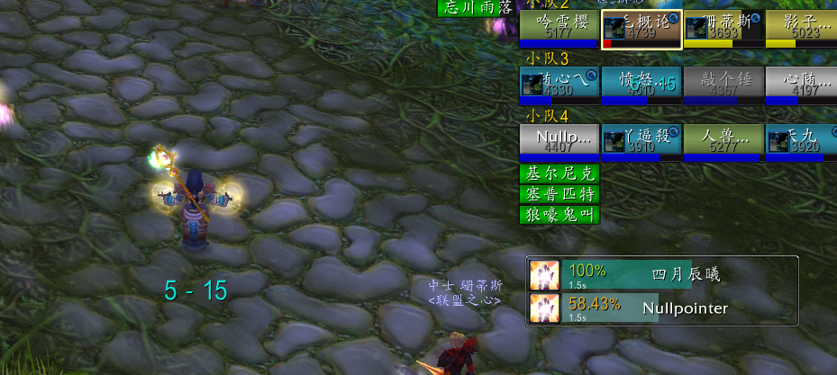

# Prist (for Classic)

治疗职业法术条辅助工具

## FEATURES

* 队友施法提示
* 施法完成时间排序
* 显示治疗溢出比例

## SNAPSHOT

<!-- ## DOWNLOAD -->

<!-- * forcecurse -->

# EXISTS BUGs 

* 其他角色施法打断无法检测

## ROADMAP

* 根据施法目标进行分组
* 可预期的过量提示

## BUG/建议

添加 issue 或者在 碧玉矿洞(联盟)(CN) 密 Nullpointer

## CONTRUBUTE

CREATE PR <- here